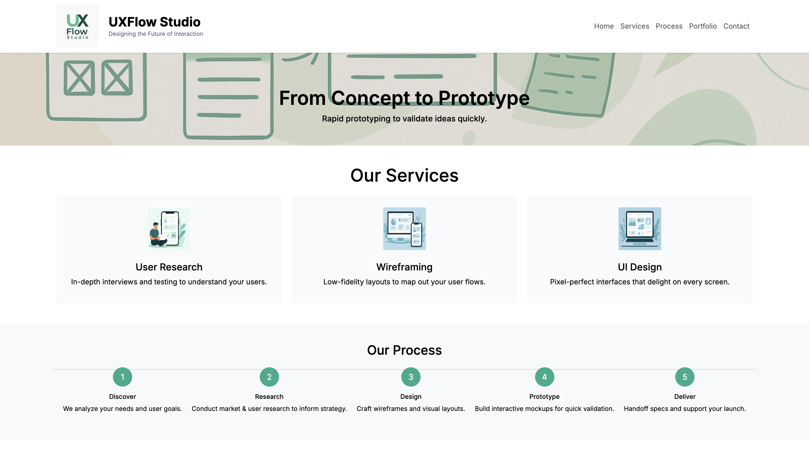

# UXFlow Studio



## Description

UXFlow Studio is a clean, modern UI/UX front-end template showcasing a fictional design agency’s capabilities. It features a responsive hero carousel, services overview, process flow, portfolio showcase, testimonials, and a contact form—all styled with a fresh green accent and smooth animations.

## Features

- **Responsive Layout**: Mobile-first design using Bootstrap 5.  
- **Hero Carousel**: Translucent, full-width slides with bold captions.  
- **Services Section**: Interactive cards with hover accents.  
- **Process Flow**: Step-by-step workflow with a continuous connector line.  
- **Portfolio**: Two-column project grid with hover effects and achievement highlights.  
- **Testimonials**: Client feedback carousel.  
- **Contact Form**: Simple form with inline validation.  
- **Smooth Scroll & Reveal**: IntersectionObserver animations and anchor link scrolling.

## Technologies Used

- HTML5  
- CSS3 (Custom Properties, Flexbox & Grid)  
- JavaScript (ES6+)  
- Bootstrap 5  
- Google Fonts (Inter)  
- Bootstrap Icons  

## Installation & Usage

1. **Clone the repository**  
   ```bash
   git clone https://github.com/your-username/uxflow-studio.git
